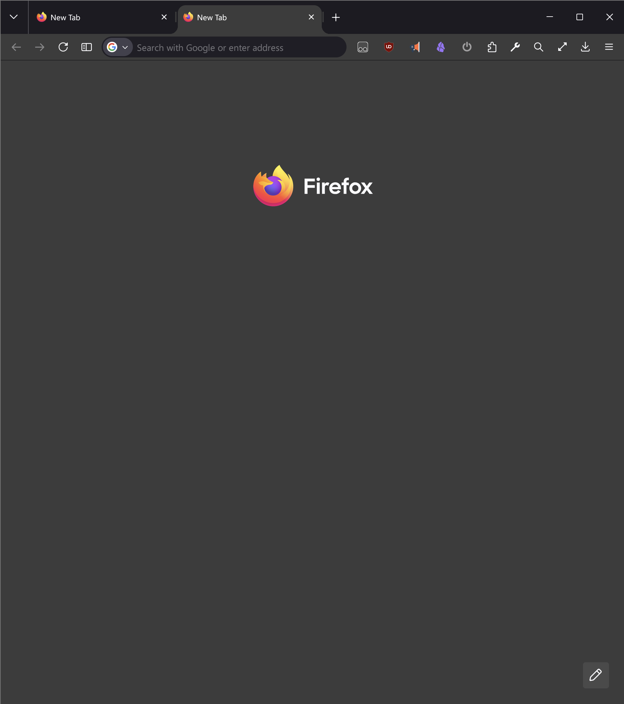
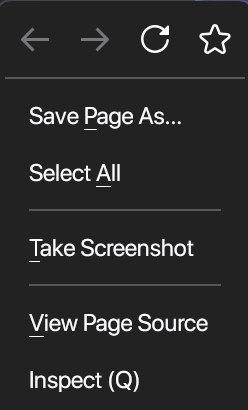
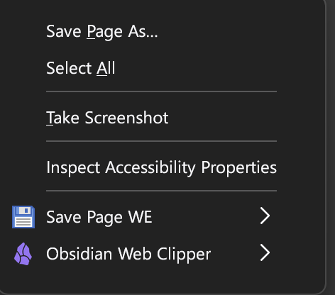

# Fire Chrome
Make Firefox look proper
## Find profile folder
under `about:support` click **Open Folder** in row **profile folder**
## Drop files
- drop `user.js` in this dir
- create **chrome** dir if it doesn't exist, drop both css into **chrome**
## Before and After
<table>
    <tr>
        <td width="50%">
            
<strong>Default Firefox</strong>

            
        </td>
        <td width="50%">
            
<strong>Fire Chrome</strong>

            
        </td>
    </tr>
    <tr>
        <td width="30%">
            
<strong>Default Firefox</strong>

            
        </td>
        <td width="70%">
            
<strong>Fire Chrome</strong>

            
        </td>
    </tr>
</table>